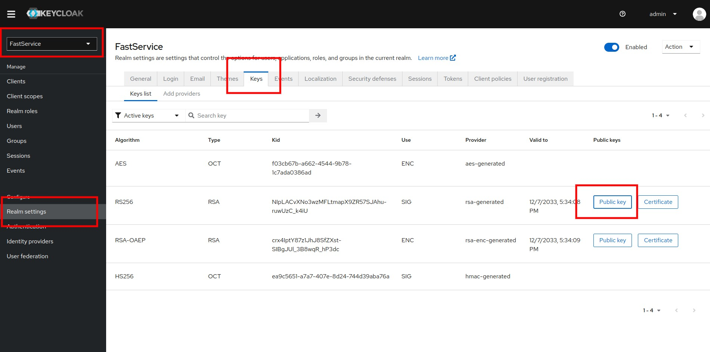

# Basic Webapp with React and NodeJs secured with Keycloak

This is a simple web application to demonstrate how to setup keyloak with a React frontend and Nodejs backend.


## Installation

Step 1 : Clone this repo & Move to the directory
```bash
  git clone git@github.com:[username]/keycloak-demo.git
  cd keycloak-demo
```

Step 2 : Run docker compose
```bash
  docker-compose up -d
```

Step 3 : Log in to keycloak admin console at http://localhost:8080/
```
  username: admin
  password: admin
```

Step 4 : Select FastService realm and copy its RSA256 Public Key


Step 5 : Update the FastService realm public key in back/.env with the copied key from step 4

Step 6 : Install all dependencies
```bash
  cd back
  npm install
```
```bash
  cd front
  npm install
```


## Deployment

You can now run this project
### Start the backend
```bash
  cd back
  npm run start
```
### Start the frontend
```bash
  cd front
  npm run dev
```

## Use the app
- Go to http://localhost:5173 
- You should be redirected automatically to keycloak login page.
- Create a new account or log in
- You should be redirected back to http://localhost:5173 and should see the users table displayed on the screen!  
